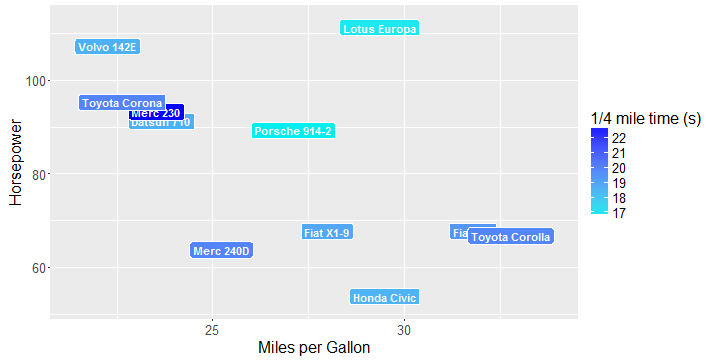

## Hypotheses (Myths) about Cars

1. More Cylinders    ==>      Fast Cars
2. Fast Cars         ==>      High Fuel Consuption
3. High Horsepower   ==>      Fast Cars

We will do a simple test on the above hypotheses by analyzing the built-in R dataset "mtcars".

---

## Introduction of Source Data (datasets::mtcars)

The data was extracted from the 1974 Motor Trend US magazine, and comprises fuel consumption and 10 aspects of automobile design and performance for 32 automobiles (1973-74 models).


```r
str(mtcars)
```

```
## 'data.frame':	32 obs. of  11 variables:
##  $ mpg : num  21 21 22.8 21.4 18.7 18.1 14.3 24.4 22.8 19.2 ...
##  $ cyl : num  6 6 4 6 8 6 8 4 4 6 ...
##  $ disp: num  160 160 108 258 360 ...
##  $ hp  : num  110 110 93 110 175 105 245 62 95 123 ...
##  $ drat: num  3.9 3.9 3.85 3.08 3.15 2.76 3.21 3.69 3.92 3.92 ...
##  $ wt  : num  2.62 2.88 2.32 3.21 3.44 ...
##  $ qsec: num  16.5 17 18.6 19.4 17 ...
##  $ vs  : num  0 0 1 1 0 1 0 1 1 1 ...
##  $ am  : num  1 1 1 0 0 0 0 0 0 0 ...
##  $ gear: num  4 4 4 3 3 3 3 4 4 4 ...
##  $ carb: num  4 4 1 1 2 1 4 2 2 4 ...
```

--- 

## Conclusion in a Nutshell

We found positive correlation between the number of cylinders and the horsepwer.

We also found that faster cars tend to have high horsepower, but not necessarily high miles-per-gallon. This is probably because faster cars (sport cars) tend to be lighter in weight, thus require less gasoline to accelerate.

---

## Find the Answers Yourself!

Go to [findshawn.shinyapps.io/mtcars](https://findshawn.shinyapps.io/mtcars) and play with the interactive graph yourself, and see if you can draw your own conclusions!



